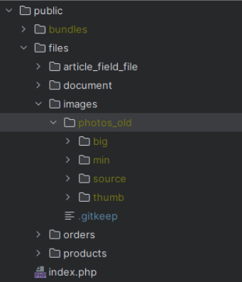

# Instalacja projektu - Windows

Niniejsza instrukcja szczegółowo opisuje instalacje na Windows z użyciem maszyny wirtualnej Linux. 

Jeśli będziesz instalował projekt na systmie operacyjnym Linux, możesz pominąć wiele kroków.


Zainstaluj Virtualbox
[VirtualBox](https://www.virtualbox.org/wiki/Downloads)


Zainstaluj Postman
[Postman](https://www.postman.com/downloads/)


Zainstaluj PHPstorm
[PHPstorm](https://www.jetbrains.com/phpstorm/download/)

Zainstaluj GitBash
[GitBash](https://git-scm.com/download/win)

## Import obrazu Virtualbox
Na początku pobierz obraz z linku:
[Obraz VirtualBox](https://drive.google.com/file/d/1ZuS-E3HsInxh-u9lpcQ7hTpPe8pXMj30/view?usp=sharing)


Gdy już go pobierzesz wybierz:
Plik (lewy górny róg VirtualBox) -> Importuj urządzenie wirtualne…


Plik wybierz (ten który pobrałeś) czyli **Wiseb2b.ova**

Kliknij **Next** a na następnym **Zakończ**

Kolejny krokiem będzie uruchomienie wirtualnej maszyny

Wybierz po lewej stronie Ubuntu 22.04 Wiseb2b i kliknij Uruchom (jeśli wcześniej nie
uruchomiła się maszyna)


---

## Konfiguracja maszyny wirtualnej i pobranie projektu


Gdy maszyna się uruchomi, będziesz musiał się zalogować.

Hasło konta to: **makumba1**


Teraz musimy uruchomić konsole(Terminal).
Można to zrobić na kilka sposobów np:
1. Naciśnij skrót klawiszowy **Ctrl+Alt+t**
2. Naciśnij ikonę znajdującą się w lewym dolnym rogu i uruchom Terminal 

### Dodanie klucza SSH (dzięki temu nie będziemy musieli wpisywać hasła podczas korzystania z githuba)

Zacznijmy od dodania klucza ssh, wykonaj poniższy kod (podmień your_email@example.com na swój email użyty na githubie (oficjalna instrukcja: [Generowanie SSH KEY](https://docs.github.com/en/authentication/connecting-to-github-with-ssh/generating-a-new-ssh-key-and-adding-it-to-the-ssh-agent)) lecz aby przyśpieszyć instalacje poniżej znajdziesz wszystkie kroki

```bash
ssh-keygen -t ed25519 -C "your_email@example.com"
```

Następnie wszystko przeklikaj enterem
enter -> enter -> enter

Dodanie klucza SSH do agenta ssh.
Na początku musimy go uruchomić za pomocą:
```bash
eval "$(ssh-agent -s)"
```

Dodaj swój klucz prywatny SSH do agenta ssh.

```bash
ssh-add ~/.ssh/id_ed25519
```

Następnie musimy zwrócić kodu ssh który trzeba umieścić na githubie 

```bash
cat ~/.ssh/id_ed25519.pub
```

Następnie ten klucz co wyświetli się w konsoli trzeba skopiować i umieścić na githubie

---

Wejdź na github.com, zaloguj się na swoje konto, następnie przejdź do ustawień


W sekcji “**Access**” wejdź do “**SSH and GPG keys**”

Kliknij “**New SSH key**”, title wpisz dowolny np. “**Wiseb2b Ubuntu**” i w polu "**Key**" umieść swój

Powinno to wyglądać mniej więcej tak:


i kliknij “**Add SSH key**”

Teraz przejdźmy do instalacji projektu wiseb2b (wróć do Terminala na maszynie wirtualnej)

---

### Instalacja projektu WiseB2B

```bash
cd ~
```

```bash
git clone git@github.com:wiseb2b-git/wiseb2b_20_docker_full.git
```

Pobraliśmy główny projekt wiseb2b z dockerem następnie pobierzmy reszte repozytoriów

Przejdźmy do katalogu i pobierzmy repozytoria

```bash
git clone git@github.com:wiseb2b-git/wiseb2b_20_docker_full.git
```

```bash
cd wiseb2b_20_docker_full
```

```bash
git clone git@github.com:wiseb2b-git/wiseb2b_20_backend.git
wiseb2b_backend
```

```bash
git clone git@github.com:wiseb2b-git/frontend.git wiseb2b_frontend
```

Teraz kopiujemy przykładowe .env na “robocze”

```bash
cp wiseb2b_frontend/.env.example wiseb2b_frontend/.env
```

```bash
cp .env.example .env
```

Teraz zaktualizujemy plik .env na frontendzie:
```bash
sudo nano ~/wiseb2b_20_docker_full/wiseb2b_frontend/.env
```

Musimy zmodyfikować tutaj kilka wartości:

```
REACT_APP_API_BASE_URL=http://wiseb2b.local
REACT_APP_OPEN_PROFILE_CLIENT_ID=ff65b8109ad27b6491be036d08b7abb9
REACT_APP_OPEN_PROFILE_CLIENT_SECRET=6b7e0aa06d4b9437b42c51e5ee57092a91b
933450d1ce3d6d087b0855130df5b8cc188968aa357b355dfe4755c95e53cd0ea3b85ae4
7162e0637816736202b03
```

Teraz aby zapisać naciśnij **Ctrl + X**

Naciśnij klawisz "**y**" oraz naciśnij **ENTER**

Teraz jeszcze zmienimy host dla xdebug
```bash
sudo nano ~/wiseb2b_20_docker_full/docker/app/Dockerfile
```

Zjeżdżasz strzałką w dół prawie do końca
i teraz zmień wartość `xdebug.client_host` na `172.17.0.1`
powinno to mniej więcej wyglądać tak:


Teraz aby zapisać naciśnij **Ctrl + X**
Naciśnij klawisz "**y**" oraz naciśnij **ENTER**

Zaktualizujmy backend
```bash
sudo nano ~/wiseb2b_20_docker_full/wiseb2b_backend/.env
```

```
#Front host
FRONT_HOST="wiseb2b.local"
WEB_PORT=80
````

### Uruchomienie projektu
W tym momencie możemy uruchomić projekt

Na początku upewnijmy się że docker ma uprawnienia

```bash
sudo chmod 666 /var/run/docker.sock
```

Następnie budujemy projekt

```bash
sudo docker compose build
```

Powyższy kod trzeba uruchomić za pierwszym razem oraz wtedy kiedy zmodyfikujemy pliki .env bądź pliki Dockerfile (zwykle piszemy o tym na kanale [google chat] WiseB2B - backend

Aby uruchomić projekt wykonaj poniższą komendę:

```bash
sudo docker compose up 
```

### Pierwsze uruchomienie

Po pierwszym uruchomieniu kontenerów nie zapominajmy o zainstalowaniu zależności w kontenerze app (zrób to w nowym terminale nie wyłączając wcześniejszego):

```bash
cd wiseb2b_20_docker_full
```

```bash
sudo docker compose exec app bash
```

```bash
composer install
```

Jak już wykonaliśmy composer install możemy zająć się bazą danych
Warto zobaczyć w tym miejscu README.md repozytorium: https://github.com/wiseb2b-git/wiseb2b_20_backend

Ale zajmijmy się migracjami:

**Usuwamy bazę danych**
```bash
php bin/console doctrine:database:drop --force
```

**Tworzymy bazę od nowa**
```bash
php bin/console doctrine:database:create
```

**Uwaga. Po wykonaniu poniższej komendy może wyświetlić czerwony komunikat (duplikat)
Prosimy go zignorować. Ważne aby wykonać tą komendę.**
```bash
php bin/console doctrine:database:create --connection admin
```

**Aktualizujemy schemat bazy (tworzy wszystkie tabele)**
```bash
php bin/console doctrine:schema:update --force
```
```bash
php bin/console doctrine:schema:update --em=admin --force
```

**Uruchamiamy migrację danych**
```bash
php bin/console doctrine:migration:migrate
```

Teraz zamknij maszynę wirtualną, możesz to zrobić klikając w prawym górnym rogu X tak jakbyś chciał zamknąć okno i wybierz: “**Wyślij sygnał wyłączenia**”


Ostatnim krokiem będzie konfiguracja karty sieciowej

W tym celu w lewym górnym rogu programu Virtualbox kliknij:

**Plik -> Narzędzia -> Network Manager**


Przejdź do właściwości, kliknij **VirtualBox Host-Only**, przejdź do Serwer DHCP i odznacz “**Włącz serwer**”


A w zakładce Karta wybierz opcję: Skonfiguruj kartę ręcznie

w polu Adres IPv4: `192.168.50.1`

a w polu Maska sieci IPv4: `255.255.255.0`

Teraz możemy jeszcze raz uruchomić maszynę wirtualną
Gdy się uruchomi, musimy uruchomić terminal (skrót klawiszowy **Ctrl + Alt + T**)
Przejdź do katalogu projektu i uruchom dockera

## Konfiguracja Windows

W tym dziale działamy już na Windows a nie na maszynie wirtualnej(nie wyłączaj jej)!

Na początku spingujmy maszynę aby zobaczyć czy mamy do niej dostęp z Windowsa.

---

### Sprawdzenie czy łączymy się z wirtualną maszyną
Otwórz Terminal i użyj komendę: 

```bash
ping 192.168.50.101
```

### Edycja pliku hosts

Musisz wprowadzić zmiany do swojego pliku /etc/hosts

Wejdź do katalogu: **C:\Windows\System32\drivers\etc**

Otwórz plik **hosts** za pomocą notatnika

Na końcu pliku dopisz:

```
192.168.50.101 wiseb2b.local
```

Teraz gdy wszystko dobrze skonfigurowaliśmy gdy wpiszesz w przeglądarkę link:

wiseb2b.local zobaczysz frontend aplikacji

Login: `biuro@sente.pl`

Hasło: `test1234`

**UWAGA! Jeśli masz problem z zalogowanie a w Network widzisz:**


To oznacza że skopały się permisje dla katalogu var i jej podrzędnych.

W tym celu wróć do Ubuntu, wejdź do katalogu wiseb2b_backend

Warto zapamiętać poniższy krok ponieważ czasem będzie to wymagane po puszczeniu `composer install`

```bash
cd ~/wiseb2b_20_docker_full/wiseb2b_backend
```

a następnie wpisz:
```bash
sudo chmod 777 -R var
```

### Dodanie klucza SSH do github (klucz z Windows aby lokalnie nie trzeba było wpisywać hasła)

Zacznijmy od dodania klucza ssh, wykonaj poniższy kod (podmień your_email@example.com na
swój email użyty na githubie (oficjalna instrukcja:

```bash
ssh-keygen -t ed25519 -C "your_email@example.com"
```

Następnie wszystko przeklikaj enterem

Dodanie Agenta
Otwórz program `Git Bash`

Wpisz poniższe komendy:

**Uruchomienie agenta SSH w tle**
```bash
eval "$(ssh-agent -s)"
```

**Dodawanie klucza prywatnego do SSH agenta**
```bash
ssh-add ~/.ssh/id_ed25519
```


Wyglądać to będzie mniej więcej tak:


Wyświetlenie klucza potrzebnego do github.com:

```bash
cat ~/.ssh/id_ed25519.pub
```

Teraz ten wyświetlony klucz musimy dodać na **github.com**

Wejdź na **github.com**, zaloguj się na swoje konto, następnie przejdź do ustawień


W sekcji `Access` wejdź do “**SSH and GPG keys**”
Kliknij “**New SSH key**”, title wpisz dowolny np. “**Wiseb2b Windows**” i w polu "**Key**" umieść swój
klucz powinno to wyglądać mniej więcej tak


## Konfiguracja PHPstorm

Teraz skonfigurujemy PHPstorm abyśmy mogli modyfikować kod

**Wykonaj poniższe komendy w konsoli lokalnej (na windows)**
```
git config core.autocrlf false
git config --global core.autocrlf false
git config core.fileMode false
git config --global core.fileMode false
git config --global fetch.prune true
```

### Zacznijmy od stworzenia projektu

Projekt tworzymy za pomocą: `New Project from Existing Files..`

Poniżej możesz zobaczyć jak uruchomić tą opcję:

Widok Welcome PhpStorm:


Widok z projektu
Musisz wejść w `File -> New Project from Existing Files..`


1. Gdy otworzy się nowe okno wybierz opcję:
   `Web server is on remote host, files are accessible via FTP/SFTP/FTPS/WebDAV` i kliknij **Next**


2. Nazwij sobie projekt i wybierz lokalizację (jaką chesz) i kliknij **Next**
3. Wybierz opcję `Add new remote server`

   Name nazwij sobie `WiseB2B_DockerFull` (choć może być dowolna)

   Type zmień na `SFTP`

   Przy SSH configuration naciśnij trzy kropeczki
   (następnie "Kliknij plus w lewym górnym rogu")

    W Host wpisz: `192.168.50.101`

    Username: `wiseb2b`

    Port: `22`

    Password: `makumba1`

   I kliknij **OK**
4. Przy Root path kliknij ikone katalogu
5. Przejdź do `/home/wiseb2b/wiseb2b_20_docker_full`
6. Po zamknięciu okna zaznacz Checkbox: `Don't check HTTP connection to server`
   i kliknij `Next`
7. W kolejnym oknie zaznacz `Project Root`
8. Następnie kliknij `Next` oraz `Create`


Teraz to trochę potrwa ponieważ zaciąga on wszystkie pliki z maszyny wirtualnej do nowego
projektu postawionego lokalnie

---

### Pobranie z maszyny wirtualnej brakującego katalogu .git

1. Na górze (na pasku), wybierz `Tools -> Deployment -> Options`
2. W oknie wybierz Exclude items by name i usuń stamtąd: `.git`;
3. Teraz wróć do drzewka projektu i kliknij prawym przyciskiem myszy na główny katalog projektu (docker_full) i wybierz `Deployment -> Download from ...`

W tym momencie pobiorą się z maszyny wirtualnej pliki z informacją o gicie, które wcześniej nie zostały pobrane.

### Uruchomienie automatycznego Uploadu do maszyny wirtualnej zmian
Aby to, co robimy w PHPstormie automatycznie zapisywało się na serwerze musimy włączyć
automatyczny upload.

W tym celu wejdź na górze (w pasku) `Tools -> Deployment -> Options`

Wybierz opcję w: `Upload changed files automatically to the default server` na `Always`

oraz zaznacz checkbox: `Delete remote files when local are deleted`

Wszelkie zmiany w kodzie, które wykonasz w PHPstormie będą automatycznie zapisywane
na serwerze. 

Wystarczy, że napiszesz kod i zapiszesz plik **(CTRL + S)** aby zmiany zostały zapisane na
serwerze.

I projekt jest gotowy do pracy.

---

### Jak działać z kodem?

**Uwaga 1:**
Modyfikacja kodu oraz wykorzystywanie Git’a (tworzenie branchy, pull, push itd) robisz
lokalnie (na windowsie)

Tak naprawdę od chwili obecnej musisz wiedzieć, że (mówie o sytuacji gdy wyłączyłeś
laptop wychodząc z pracy i włączasz go następnego dnia) wirtualną maszynę tylko
uruchamiasz.

Wchodzisz do katalogu dockerfull, wpisujesz docker compose up i to jest wszystko co
robisz z maszyną wirtualną… minimalizujesz ją i zapominasz, że istnieje. Przypominasz
sobie o nim podczas chęci uruchomienia `composer install`

A jeszcze lepiej tylko kliknąć Uruchom w Virtualbox
i w PHPstormie uruchomić terminal maszyny wirtualnej.

Aby to zrobić na dole w terminalu naciśnij strzałke do dołu i wybierz opcje wiseb2b@...


Później wpisujesz komendy:


```bash
cd wiseb2b_20_docker_full
```

```bash
sudo docker compose up -d
```

Czekasz chwile (minute, może dwie) i wchodzisz w przeglądarce na wiseb2b.local

Jak pokaże Ci się front to znaczy, że wszystko działa

Wracając. Wszystko pozostałe robimy lokalnie w lokalnym terminalu


**Uwaga 2:**
Załóżmy, że chcesz zrobić nowe zadanie.

Postępuj w następujący sposób:

1. Lokalnie przechodzisz do backendu (Terminal Local)
```bash
cd .\wiseb2b_backend\
```

2. Pobierz zmiany
```bash
git checkout development
git pull origin developmen
```

3. Później przesyłasz zmiany które zostały pobrane lokalnie na wirtualną maszynę
   Po lewej stronie w PHPstorm w strukturze projektu naciśnij prawym na katalog
   wiseb2b_backend i wybierasz `Deployment -> Upload to …`

4. Gdy te zmiany zostaną przesłane na maszynie wirtualnej puszczamy composer install (bo
   ktoś mógł dodać jakąś bibliotekę a dodatkowo po wpisaniu tej komendy czyści cache oraz
   buduje testerów potrzebnych do uruchomienia testów automatycznych)

   W tym celu otwórz terminal maszyny wirtualnej za pomocą strzałki w dół (sekcja Terminal) i
   wybierz opcje wiseb2b@...
   wpisujesz te komendy:
```bash
cd ~/wiseb2b_20_docker_full
```

```bash
docker compose exec app bash
```

```bash
composer install
```

Teraz mamy gotową maszynę (ma wszystkie zmiany, cache wyczyszczony, biblioteki
ogarnięte)

Teraz w konsoli lokalnej (Terminal Local) utwórz nowy branch z nazwą zadania

```bash
git branch <nazwa_zadania>
```
np. git branch WIS-1234

teraz wejdź do tego brancha
```bash
git checkout <nazwa_zadania>
```

np. git checkout WIS-1234

i od teraz możesz wykonywać zadanie.

### Dodanie zdjęć produktów
1. Pobierz zdjęcia z linku (lokalnie w Windows): [Pobierz zdjęcia](https://drive.google.com/file/d/10v1yhhuyctWcAeFGS5Tmr7mTxcok4hs1/view)
   
2. W katalogu `wiseb2b_backend/public/files/images`, utwórz katalog: `photos_old`
3. Do tego utworzonego katalogu wrzuć zawartość katalogu photos z zipa.
   Czyli w katalogu photos_old będziesz miał katalogi (bin,min,source,thumb)



4. Teraz kliknij prawym na images i `Development->Upload to…`
   (chodzi tu o to aby te pliki umieszczone lokalnie, znalazły się na maszynie wirtualnej)

### Zmiany w commit

Czasem może się zdarzyć, że będziesz miał bardzo dużo zmian w changes (a jeszcze nic
nie edytowaliśmy). Poniżej dowiesz się jak sobie z tym poradzić:


Aby rozwiązać ten problem:
1. Wejdź do katalogu `wiseb2b_backend`
2. Użyj komendy:
```bash
git config core.fileMode false
```
3. Zresetuj PHPstorm

### Używanie bazy danych w PHPstorm

1. Po prawej stronie PHPstorm kliknij `Database`
2. Następnie Kliknij + (lewy górny róg okna) -> `DataSource -> PostgreSQL`


3. Skonfigurujmy ustawienia do połączenia się z bazą danych

   Host: `wiseb2b.local`

   Port: `5435`

   User: `psql_wiseb2b`

   Password: `psql_wiseb2b`

   Database: `psql_wiseb2b`

4. Kliknij na dole w “**Test Connection**” aby zweryfikować czy dane są poprawne
5. Gdy pojawi się zielony ptaszek oznaczający Sukces, przejdź do zakładki Schemas
6. Kliknij w **wiseb2b20** i zaznacz **All schemas**


8. Kliknij **Apply** oraz **OK**

## Konfiguracja Postman
Aby zaimportować endpointy do postmana należy pobrać jsona z informacjami o
endpointach. Poniższe kroki pokazują jak zaimportować AdminApi lecz import UiApi robi się
analogicznie.
Link do jsonów:

http://wiseb2b.local/admin-api/doc.json

http://wiseb2b.local/ui-api/doc.json


Import AdminApi
1. Uruchom aplikacje (`sudo docker compose up`), jeśli masz już ją uruchomioną, pomiń
   ten krok
2. Wejdź na stronę: http://wiseb2b.local/admin-api/doc.json (chwile może potrwać całe
   załadowanie jsona)
3. Skopiuj całą zawartość strony, która pojawi się na ekranie
4. Uruchom Postmana, zaloguj się (po zalogowaniu daje większe możliwości)
5. W lewym górnym rogu kliknij Import.
   Poniżej zamieściłem screeny możliwych okien które mogą się uruchomić po
   kliknięciu import
   (Jeśli wyświetli się okno jak z opcjami na górze to przejdź do **RawText**)
6. W polu tekstowym wklej tego skopiowanego wcześniej jsona


### Import UiApi

Wygląda tak samo jak import AdminApi z tą różnicą że jsona trzeba skopiować ze strony:
http://wiseb2b.local/ui-api/doc.json

Konfiguracja Postmana
Teraz musimy nadpisać domyślną konfiguracje aby API poprawnie łączyło się z naszym
backendem

Na początku zmieńmy zmienne


1. Po lewej stronie (na drzewku) kliknij `WiseB2B ADMIN API`
2. Przejdź do zakładki Variables
3. Zmień Initial value i current value dla baseUrl na wiseb2b.local
   Dodajmy jeszcze nową zmienną xdebug której wartość ustaw na: `XDEBUG_SESSION=START`
4. Kliknij Save aby zapisać zmiany
* Powyższe kroki (modyfikacja zmiennych) wykonaj tak samo w WiseB2B UI API

### Podmiana body dla Tokenów

Aby szybko generować tokeny autoryzacyjne musimy nadpisać body dwóch endpointów,
1. W drzewku po lewej stronie rozwiń `WiseB2B ADMIN API`, przejdź do token i kliknij
   POST `post authorization Token`


2. Przejdź do zakładki Body
3. Do pola tekstowego wklej:

```json
{
"client_id": "dea9d5efaa0c34dd67400874f3e13e7a",
"client_secret":
"8eefe0a060250c96cc9ee1bada11d4069ca6553b9dae4f81180f9777866db0799010e9fe75a0244d209924d1337946393f1682a5d52e07a738dc842891d97509"
}
```
Warto w tym miejscu kliknąć **SEND** (ten niebieski przycisk) aby sprawdzić czy wszystko
poprawnie działa. 

Gdy na dole body zwróci access_token, to znaczy, że poprawnie
przekazaliśmy dane.
4. Kliknij `Save` aby nie musieć później znowu wklejać tego jsona

---

Teraz możemy zrobić podobną sytuacje w UiApi
1. Na drzewku rozwiń `WiseB2B UI API` przejdź do `auth -> login`
   
2. Kliknij `post wise security apiui postlogin postlogin`
2. Przejdź do Body
3. Do pola tekstowego wklej:

```json
{
"username": "biuro@sente.pl",
"password": "test1234",
"client_id": "ff65b8109ad27b6491be036d08b7abb9",
"client_secret": "6b7e0aa06d4b9437b42c51e5ee57092a91b933450d1ce3d6d087b0855130df5b8cc188968aa357b355dfe4755c95e53cd0ea3b85ae47162e0637816736202b03"
}
```
4. Kliknij `Save` aby nie musieć później znowu wklejać tego jsona


### Jak teraz działać z Postmanem?
Załóżmy że chcemy przetestować coś z Admin Api np. `GET /products`
1. W drzewku szukasz sobie tego endpointu
2. Dostosowujesz ( w tym przypadku w Params odznacz wszystkie checkboxy aby wysłać
   request bez żadnych parametrów)
3. Kliknij `Send`

   Na dole znajduje się zawsze response czyli odpowiedź z backendu.
   Na 99.99% w tym momencie (wykonałeś wszystkie powyższe kroki i nic więcej) zobaczysz
   komunikat:
   `{"message":"Invalid token."}`

   Oznacza to, że został przesłany niepoprawny token. Tokeny używamy do autoryzacji.
   Więc teraz musimy wygenerować nowy token

1. W tym celu w drzewku przejdź do token w `WiseB2B ADMIN API` i do `POST`
2. Kliknij `Send`
3. Skopiuj zawartość `access_token`


4. Na drzewku kliknij `WiseB2B ADMIN API`
5. Przejdź do zakładki `Authorization`
6. Type zmień na `Bearer Token`
7. W Token wklej skopiowany access_token
8. Kliknij `Save`

   W tym momencie dodaliśmy nasz Token do nagłówka requestu.

   Czynność tą (czyli wygenerowanie tokenu, skopiowanie access_token, wklejenie do `Token` i
   kliknięcie `Save`) będzie trzeba powtórzyć gdy wygaśnie nam Token ale zostaniesz o tym
   poinformowany (nie dostaniesz poprawnej odpowiedzi)

   Autoryzacja dla UiApi wygląda tak samo z tą różnicą, że access_token bierzesz z endpointu
   auth/login

   Teraz gdy wrócisz do GET products zobaczysz już poprawną odpowiedź

## Konfiguracja Debuggera

### Konfiguracja Xdebug w PHPstorm

Teraz musimy skonfigurować Debug Remote abyśmy mogli używać Debug w PhpStorm

1. W tym celu w prawym górnym rogu PHPstorm rozwiń listę obok zielonej ikony (play)
   i wybierz opcję `Edit Configurations…`

    
2. Naciśnij plus (w lewym górnym rogu) i wybierz opcję `PHP Remote Debug`
3. Name może być dowolny
4. Zaznacz checkbox: `Filter debug connection by IDE key`
5. `IDE key(session id)` ustaw na: `PHPSTORM`
6. Przy Server kliknij 3 kropki
7. Name (dowolny), Host ustaw na znak podłogi czyli `“_”`, Port: `80`

   Poniżej możesz zobaczyć katalogi,

   a) przy katalogu `wiseb2b_backend` ustaw Absolute path on the server na
   `/var/www/backend`

   b) przy katalogu `wiseb2b_backend/public` ustaw Absolute path on the server na
   `/var/www/backend/public`


   Powinno to wyglądać mniej więcej tak:
   

8. Kliknij `OK`
9. I gdy się zamknie okno i powrócisz do poprzedniego tam też naciśnij `OK`
10. Wyłącz zaporę systemową w WINDOWS

### Jak debugować (POSTMAN)

Teraz gdy będziesz chciał zdebugować jakiś kod to w postmanie (w odpowiednim
endpoincie czylki ten który obsługuje ten kod, który chcesz zdebugować) w sekcji `Headers`
ustawiasz key `Cookie` a value `{{xdebug}}`


W kodzie ustawiasz Breakpoint, klikając na ten obszar koło numeru linii


i żeby zdebugować ten kod w postmanie wystarczy kliknąć `Send`

### Jak debugować (NELMIO)

1. Zainstaluj rozszerzenie Chrome Xdebug Helper
   Link:
   https://chrome.google.com/webstore/detail/xdebug-helper/eadndfjplgieldjbigjakmdgkmoaaaoc?hl=pl

2. Po zainstalowaniu warto ją sobie przypiąć do paska

   

3. Przejdź do opcji
4. Ustaw `IDE key` na `PhpStorm`

   

5. Gdy będziesz w nelmio należy uruchomić wtyczke, klikając na nią lewym przyciskiem
   myszki i wybierając Debug.
   Gdy zaświeci się na kolor zielony oznacza, że została uruchomiona

   

Teraz wystarczy zrobić breakpoint w kodzie i uruchomić request w Nelmio aby zdebugować
kod
Pamiętaj wcześniej aby zaznaczyć słuchawkę na górze PHPstorm (aby on nasłuchiwał)

### Debugowanie AdminApi (Błąd NGNIX 502)
1. Debuguj poprzez
   ```
   wiseb2b_20_docker_full$ docker compose exec web sh
   tail -f var/log/nginx/project_error.log
   ```
   W moim przypadku było to DisallowRobotsIndexingListener
   https://symfony.com/blog/new-in-symfony-4-3-automatic-search-engine-protection

2. Jest równnież inna opcja. Wystarczy puścić czyszczenie cache
```bash
    php bin/console c:c
```
i odrazu jak komenda zostanie puszczona, uruchomić debugowanie

## Zwiększenie rozmiaru dysku Ubuntu

Czasem może być tak dużo plików w cache, że zawali cały dysk.
Najlepiej pamiętać, że jest taki krok w instrukcji i w razie czego do niej wrócić wtedy.
1. W Virtualbox - (prawy górny róg) kliknij
   `Plik -> Narzędzia -> Menadżer nośników wirtualnych`
2. Na liście kliknij ten z nazwą Wiseb2b
3. Zwiększ rozmiar dysku np. do 200GB
4. Uruchom maszyne wirtualną (jeśli tego nie masz a jeśli masz to wyłącz projekt
   uruchomiony na dockerze)
5. Po lewej stronie masz pomarańczową ikonę z literką A czyli aplikacje `Ubuntu Software`
6. W prawym górnym rogu kliknij lupe i wyszukaj aplikacje `Gparted`.
7. Gdy się zainstaluje, uruchom ją (kliknij w lewym dolnym rogu Ubuntu tą ikone 9
   kwadratów czyli listę aplikacji i wejdź na drugą stronę (pewnie tam będzie)
8. Wpisz hasło konta
9. Może wyświetlić Ci się powiadomienie z dwoma opcjami Fix albo Ignore, kliknij `Fix`
9. Kliknij przy `/dev/sda3`, prawym przyciskiem myszy i wybierz Unmount
10. Wyskoczy Ci powiadomienie, że nie można tego zrobić ale odblokuje Ci to możliwość.
    Kliknij OK
11. Znowu naciśnij prawym na `/dev/sda3` i wybierz opcje Resize
12. Zwiększ sobie ile chcesz (teraz zwiększasz rozmiar partycji głównej w Ubuntu) najlepiej
    nie do końca (troszke zostaw)
13. Gdy to zrobisz kliknij zielone kółko z ptaszkiem aby potwierdzić zmiany
14. Gdy to zrobisz najlepiej zresetować maszyne
15. Rozmiar został zwiększony :)


