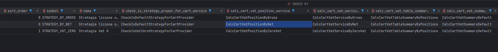
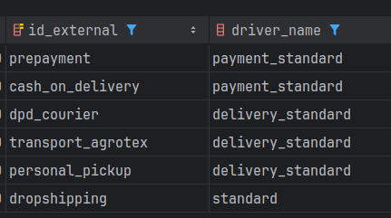

# Kalkulatory koszyka - jak są wyliczane ceny

Kwoty na koszyku w systemie **WiseB2B** są wyliczane za pomocą tzw. **"Kalkulatorów"**.

Są to specjalne serwisy, które wykonują operacje na koszyku, aby obliczyć wartości, takie jak: łączna wartość koszyka, wartość poszczególnych pozycji oraz ceny usług. Kalkulatory są ułożone w określonej kolejności, przez którą przechodzi koszyk, co umożliwia precyzyjne wyliczenie ostatecznej kwoty.
### Wywoływanie Wyliczenia Koszyka

Wyliczenie koszyka jest uruchamiane za pomocą emisji zdarzenia `CartNeedsRecalculateEvent`. Takie zdarzenie jest emitowane za każdym razem, gdy następuje modyfikacja koszyka, np. przy dodawaniu, edytowaniu lub usuwaniu pozycji.

Przykład klasy `Cart`, która emituje zdarzenie `CartNeedsRecalculateEvent`:

```php
class Cart extends AbstractEntity
{
    protected function entityHasChanged(string $newHash): void
    {
        parent::entityHasChanged($newHash);

        DomainEventManager::instance()->post(new CartNeedsRecalculateEvent($this));
        DomainEventManager::instance()->post(new CartHasChangedEvent($this->getId()));
    }
}
```

W powyższym kodzie, za każdym razem, gdy encja koszyka ulegnie zmianie (`entityHasChanged`), emitowane są zdarzenia `CartNeedsRecalculateEvent` oraz `CartHasChangedEvent`. To wywołuje ponowne wyliczenie wartości koszyka.

### Serwis `CartCalculateService`

Listener nasłuchujący na zdarzenie `CartNeedsRecalculateEvent` odwołuje się bezpośrednio do serwisu `Wise\Cart\Service\Cart\CartCalculateService`. Serwis ten jest odpowiedzialny za uruchomienie wszystkich kalkulatorów. Wykorzystuje on mechanizm providerów, który zbiera wszystkie klasy otagowane jako `cart.calculator` i wykonuje je w odpowiedniej kolejności.

#### Kod źródłowy `CartCalculateService`

```php
namespace Wise\Cart\Service\Cart;

class CartCalculateService
{
    private iterable $calculators = [];

    public function __construct(
        #[TaggedIterator('cart.calculator')]
        iterable $calculators,
        private readonly Stopwatch $stopwatch
    ) {
        Assert::allImplementsInterface($calculators, CartCalculatorInterface::class);
        $this->calculators = $calculators;
    }

    public function calculate(Cart $cart): void
    {
        $this->stopwatch->start('cart_calculate');
        foreach ($this->calculators as $calculator) {
            $this->stopwatch->start('cart_calculate_' . $calculator::class);
            if ($calculator->needsCalculations($cart)) {
                $calculator->calculate($cart);
            }
            $this->stopwatch->stop('cart_calculate_' . $calculator::class);
        }
        $cart->setCalculated();
        $this->stopwatch->stop('cart_calculate');
    }
}
```

**Opis Kodu:**
- **`TaggedIterator('cart.calculator')`**: Mechanizm ten zbiera wszystkie serwisy otagowane jako `cart.calculator`.
- **Metoda `calculate`**: Przechodzi przez wszystkie kalkulatory i wykonuje je w odpowiedniej kolejności. Każdy kalkulator sprawdza, czy potrzebuje być wykonany za pomocą metody `needsCalculations()`. Następnie wywoływana jest metoda `calculate()`, która przelicza wartości dla koszyka.

### Konfiguracja Kalkulatorów i Ich Kolejność

Kalkulatory są skonfigurowane w pliku `services.yaml` dla modułu `Cart`. Przykład konfiguracji kalkulatorów:

```yaml
### Kalkulatory odpowiedzialne za obliczenia wartości koszyka oraz pozycji koszyka na podstawie
### produktów, usług, przesyłki, płatności, podatków itp.
###
###### Priorytety:
###### 6000 - powyżej - wolne miejsce

###### 5000 - 5999 Kalkulatory wymagane do przeliczenia pozycji koszyka
Wise\Cart\Domain\Cart\Calculator\ProductPricesRefresher:
  tags:
    - { name: cart.calculator, priority: 5950 }

Wise\Cart\Domain\Cart\Calculator\StrategyCalculator:
  tags:
    - { name: cart.calculator, priority: 5949 }

Wise\Cart\Domain\Cart\Calculator\PositionsCalculator:
  tags:
    - { name: cart.calculator, priority: 5940 }

Wise\Cart\Domain\Cart\Calculator\ServicePricesRefresher:
  tags:
    - { name: cart.calculator, priority: 5910 }

Wise\Cart\Domain\Cart\Calculator\ServicesCalculator:
  tags:
    - { name: cart.calculator, priority: 5900 }

###### 4000 - 4999 Kalkulatory zmieniające wartości na już przeliczonym koszyku
Wise\Cart\Domain\Cart\Calculator\ShippingCalculator:
  tags:
    - { name: cart.calculator, priority: 4500 }

Wise\Cart\Domain\Cart\Calculator\PaymentCalculator:
  tags:
    - { name: cart.calculator, priority: 4490 }

Wise\Cart\Domain\Cart\Calculator\CartVatTableSummaryCalculator:
  tags:
    - { name: cart.calculator, priority: 4460 }

Wise\Cart\Domain\Cart\Calculator\CartCalculator:
  tags:
    - { name: cart.calculator, priority: 4050 }

###### <4000 wolne miejsce
```

**Opis Konfiguracji:**
- Kalkulatory są otagowane jako `cart.calculator` i mają przypisane priorytety.
- **Priorytet** określa kolejność wykonywania kalkulatorów. Im wyższy priorytet, tym wcześniej kalkulator zostanie wykonany.
- **Dlaczego priorytety nie są obok siebie?** Priorytety są ustawione w taki sposób, aby umożliwić dodawanie własnych kalkulatorów w trakcie wdrożenia. Jeśli chcemy dodać kalkulator, który ma być wykonany pomiędzy istniejącymi kalkulatorami, możemy ustawić jego priorytet w odpowiednim przedziale.


Na przykład, jeśli chcielibyśmy dodać nowy kalkulator, który ma zostać wykonany pomiędzy wyliczeniem cen pozycji w koszyku a aktualizacją cen usług, musielibyśmy nadać mu priorytet w przedziale 5911-5939.


### Kolejność Wykonywania Kalkulatorów

Kalkulatory są uruchamiane w określonej kolejności. Poniżej przedstawiamy listę kalkulatorów i ich priorytety:

1. **`ProductPricesRefresher`** (priorytet: 5950) - Odświeża ceny produktów.
2. **`StrategyCalculator`** (priorytet: 5949) - Kalkulator strategii.
3. **`PositionsCalculator`** (priorytet: 5940) - Przelicza pozycje koszyka.
4. **`ServicePricesRefresher`** (priorytet: 5910) - Odświeża ceny usług.
5. **`ServicesCalculator`** (priorytet: 5900) - Kalkulator usług.
6. **`ShippingCalculator`** (priorytet: 4500) - Kalkulator kosztów przesyłki.
7. **`PaymentCalculator`** (priorytet: 4490) - Kalkulator płatności.
8. **`CartVatTableSummaryCalculator`** (priorytet: 4460) - Kalkulator sumaryczny tabeli VAT.
9. **`CartCalculator`** (priorytet: 4050) - Kalkulator podsumujący koszyk


## Strategia Kalkulatora - Wyznaczanie Strategii Wyliczenia Koszyka

Pierwszy kalkulator, który się uruchomi, to kalkulator weryfikujący, jaka strategia ma być zastosowana podczas wyliczenia koszyka.
Strategia kalkulacji odnosi się do sposobu, w jaki ceny powinny być wyliczane w koszyku, tj.:
- z ceny netto,
- z ceny brutto,
- czy na koszyku ma być VAT = 0 (np. dla klientów zagranicznych).

### Klasa `StrategyCalculator`

Poniżej przedstawiono klasę `StrategyCalculator`, która wybiera odpowiednią strategię obliczania VAT w koszyku.

```php
namespace Wise\Cart\Domain\Cart\Calculator;

/**
 * Wybranie odpowiedniej strategii obliczania VAT na koszyku
 */
class StrategyCalculator implements CartCalculatorInterface
{
    public function __construct(
        private readonly ListCartCalcStrategyServiceInterface $listCartCalcStrategyService,
        private readonly CartCalcStrategyRepositoryInterface $calcStrategyRepository,
        private readonly CartCalcStrategyServiceInterface $cartCalcStrategyService,
        private readonly ProductPricesByProductUnitIdsService $productPricesByProductUnitIdsService,
    ) {}

    public function needsCalculations(Cart $cart): bool
    {
        return $cart->needsRecalculate();
    }

    public function calculate(Cart $cart): void
    {
        $cartStrategies = $this->getStrategies();

        // Iteruje po skonfigurowanych strategiach
        foreach ($cartStrategies as $strategy) {
            // Pobieram serwis dla strategii weryfikujący czy koszyk może skorzystać z danej strategii
            $service = $this->cartCalcStrategyService->getStrategyService($strategy['symbol'], CheckIsStrategyProperForCartInterface::class);

            // Dokonuje weryfikacji
            $checkStrategy = ($service)($this->calcStrategyRepository->find($strategy['id']), $cart);

            // Jeśli znaleziono odpowiednią strategię, to ją ustawiamy i przerywamy pętlę
            if ($checkStrategy) {
                // Jeśli strategia się zmieniła, to wywołuję metodę onChangedStrategy
                if ($cart->getCalcStrategySymbol() !== $strategy['symbol']) {
                    $this->onChangedStrategy($cart, $strategy);
                }

                $cart->setCalcStrategySymbol($strategy['symbol']);
                break;
            }
        }
    }
}
```

W powyższym przykładzie iterujemy po wszystkich strategiach, które mamy zdefiniowane w bazie danych. Strategie te wskazują, które serwisy uruchamiać w zależności od danej strategii.


Na początku zajmiemy się omówieniem tego fragmentu kodu. Iterujemy po strategiach, gdzie w pierwszym parametrze podajemy symbol strategii, a następnie interfejs, który określa, jaki typ serwisów chcemy uzyskać. W naszym przypadku chcemy uzyskać serwis, który pozwoli nam wybrać odpowiednią strategię:

```
$this->cartCalcStrategyService->getStrategyService($strategy['symbol'], CheckIsStrategyProperForCartInterface::class);
```




### Implementacja `CartCalcStrategyService`

```php
namespace Wise\Cart\Domain\CartCalcStrategy\Service;

class CartCalcStrategyService extends AbstractEntityDomainService implements CartCalcStrategyServiceInterface
{
private iterable $checkStrategyForCartServices;
private iterable $calcCartVatPositionServices;
private iterable $calcCartVatServiceServices;
private iterable $calcCartVatSummaryTableServices;
private iterable $calcCartVatSummaryServices;

    public function __construct(
        private readonly CartCalcStrategyRepositoryInterface $repository,
        private readonly EntityDomainServiceShareMethodsHelper $entityDomainServiceShareMethodsHelper,
        private readonly ContainerInterface $container,
        private readonly SessionInterface $session,
        #[TaggedIterator('cart.check_strategy_for_cart')] iterable $checkStrategyForCartServices,
        #[TaggedIterator('cart.calc_cart_vat_position')] iterable $calcCartVatPositionServices,
        #[TaggedIterator('cart.calc_cart_vat_service')] iterable $calcCartVatServiceServices,
        #[TaggedIterator('cart.calc_cart_vat_summary')] iterable $calcCartVatSummaryServices,
        #[TaggedIterator('cart.calc_cart_vat_table_summary')] iterable $calcCartVatSummaryTableServices
    ) {
        parent::__construct(
            repository: $repository,
            notFoundException: NotFoundStrategyToCalcCartException::class,
            entityDomainServiceShareMethodsHelper: $entityDomainServiceShareMethodsHelper
        );

        $this->checkStrategyForCartServices = $checkStrategyForCartServices;
        $this->calcCartVatPositionServices = $calcCartVatPositionServices;
        $this->calcCartVatServiceServices = $calcCartVatServiceServices;
        $this->calcCartVatSummaryServices = $calcCartVatSummaryServices;
        $this->calcCartVatSummaryTableServices = $calcCartVatSummaryTableServices;
    }

    /**
     * Zwraca serwis strategii na podstawie symbolu strategii i interfejsu, jaki powinien implementować.
     */
    public function getStrategyService(string $strategySymbol, string $interfaceClass): ?object
    {
        $key = str_replace(['/', ',', '\\', ' ', '-'], '_', strtolower($strategySymbol . '_' . $interfaceClass));

        if ($this->session->has($key)) {
            $strategyService = $this->session->get($key);
        } else {
            $strategy = $this->repository->findOneBy(['symbol' => $strategySymbol]);

            $strategyService = match ($interfaceClass) {
                CheckIsStrategyProperForCartInterface::class => $strategy->getCheckIsStrategyProperForCartService(),
                CalcCartVatPositionInterface::class => $strategy->getCalcCartVatPositionService(),
                CalcCartVatTableSummaryInterface::class => $strategy->getCalcCartVatTableSummaryService(),
                CalcCartVatSummaryInterface::class => $strategy->getCalcCartVatSummaryService(),
                CalcCartVatServiceInterface::class => $strategy->getCalcCartVatServiceService(),
                default => throw new \InvalidArgumentException('Invalid interface class')
            };

            $this->session->set($key, $strategyService);
        }

        $listServices = match ($interfaceClass) {
            CheckIsStrategyProperForCartInterface::class => $this->checkStrategyForCartServices,
            CalcCartVatPositionInterface::class => $this->calcCartVatPositionServices,
            CalcCartVatServiceInterface::class => $this->calcCartVatServiceServices,
            CalcCartVatTableSummaryInterface::class => $this->calcCartVatSummaryTableServices,
            CalcCartVatSummaryInterface::class => $this->calcCartVatSummaryServices,
            default => throw new \InvalidArgumentException('Invalid interface class')
        };

        if (empty($strategyService)) {
            throw new CommonLogicException('Strategia nie posiada przypisanego serwisu');
        }

        foreach ($listServices as $service) {
            if (str_contains(strtolower($service::class), strtolower($strategyService))) {
                return $service;
            }
        }

        throw new CommonLogicException("Nie znaleziono serwisu dla strategii wyliczania koszyka ({$interfaceClass})");
    }
}
```
**Opis działania**

Każda strategia ma zdefiniowane serwisy wyliczające, z których może korzystać. Serwis `CartCalcStrategyService` zwraca serwis odpowiadający określonej strategii.

Załóżmy, że przekazujemy:


```php
$strategySymbol = 'STRATEGY_BY_GROSS';
$interfaceClass = CheckIsStrategyProperForCartInterface::class;
```

W takim przypadku zostanie zwrócony serwis `CheckIsDefaultStrategyForCartProvider` (patrz wyżej na zdjęcie tabeli). Następnie pobierane są wszystkie serwisy przypisane do danego interfejsu i w pętli szukamy serwisu, którego nazwa klasy pasuje do tego symbolu.

___

### Przykład użycia w StrategyCalculator

W rzeczywistości najpierw przetworzona zostanie strategia STRATEGY_VAT_ZERO, ponieważ pole sort_order określa kolejność.


```
public function calculate(Cart $cart): void
{
    $cartStrategies = $this->getStrategies();

    // Iteracja po skonfigurowanych strategiach
    foreach ($cartStrategies as $strategy) {
        // Pobieram serwis do weryfikacji strategii dla koszyka
        $service = $this->cartCalcStrategyService->getStrategyService(
            $strategy['symbol'],
            CheckIsStrategyProperForCartInterface::class
        );

        // Dokonuję weryfikacji
        $checkStrategy = ($service)($this->calcStrategyRepository->find($strategy['id']), $cart);

        // Jeśli strategia pasuje, ustawiam ją i przerywam pętlę
        if ($checkStrategy) {
            if ($cart->getCalcStrategySymbol() !== $strategy['symbol']) {
                $this->onChangedStrategy($cart, $strategy);
            }

            $cart->setCalcStrategySymbol($strategy['symbol']);
            break;
        }
    }
}

```

Wartość `($service)($this->calcStrategyRepository->find($strategy['id']), $cart)` zwraca zawsze `boolean`.

Pętla wykonuje się, dopóki nie zostanie znaleziona strategia, która zwróci `true`. Następnie strategia jest ustawiana w koszyku.

### Przykład logiki weryfikacji strategii VatZero
```php
class CheckIsVatZeroStrategyForCarProvider implements CheckIsStrategyProperForCartInterface
{
const POLAND_COUNTRY_CODE = 'PL';

    public function __construct(
        private readonly GetClientDetailsServiceInterface $getClientDetailsService,
        private readonly ListCountriesServiceInterface $listCountriesService
    ) {}

    public function __invoke(CartCalcStrategy $strategy, Cart $cart): bool
    {
        if (
            $cart->isInitialized('receiverAddress') &&
            $cart->getReceiverAddress()->isInitialized('countryCode') &&
            strtoupper($cart->getReceiverAddress()->getCountryCode()) === strtoupper(self::POLAND_COUNTRY_CODE)
        ) {
            return false;
        }

        $clientData = $this->getClientDetails($cart->getClientId());
        $europeanUnionCountries = $this->getCountriesOnEuropeanUnion();

        if ($this->isReceiverInEuropeanUnionAndHaveActiveVies($cart, $clientData, $europeanUnionCountries)) {
            return true;
        }

        return false;
    }
}
```

Jeśli żadna strategia nie zostanie znaleziona, ustawiana jest domyślna strategia z konfiguracji` (wise_cart -> check_is_default_strategy_for_cart -> default_driver_name)`.

Warto zwrócić uwagę na komentarz:

```php
// Jeśli strategia się zmieniła, to wywołuję metodę onChangedStrategy
```

W momencie, gdy zmienia się strategia, ceny produktów w koszyku są odświeżane. Dzieje się tak na przykład, gdy koszyk miał strategię `VAT0`, ale ze względu na wybór miejsca dostawy konieczna była zmiana na strategię `STRATEGY_BY_NET`.


## PositionsCalculator - Kalkulator wyliczający pozycje koszyka

Zadaniem kalkulatora jest wyliczenie łącznej kwoty pozycji w koszyku, a także wartości netto przed i po rabacie oraz stawki podatkowej.

Kalkulator ten odgrywa kluczową rolę w precyzyjnym obliczaniu kosztów dla każdej pozycji w koszyku, uwzględniając rabaty oraz odpowiednie stawki VAT.

```php
// Plik Wise\Cart\Domain\Cart\Calculator\PositionsCalculator

/**
 * Ustawia wartości dla pozycji (na podstawie rezultatu polityki wyliczonej w strategii)
 * @param CalcCartVatPositionResultAllDto $calculatePositionResult
 * @param CartPosition $position
 * @return void
 */
protected function setValuesFromPolicyResult(CalcCartVatPositionResultAllDto $calculatePositionResult, CartPosition $position): void
{
    $calculatedBasePosition = $calculatePositionResult->getBaseCalculatedPosition();
    $calculatedFinalPosition = $calculatePositionResult->getFinalCalculatedPosition();

    if($calculatedFinalPosition->getValueNet() !== null){
        $position->setValueNet($calculatedFinalPosition->getValueNet());
    }
    if($calculatedFinalPosition->getValueGross() !== null){
        $position->setValueGross($calculatedFinalPosition->getValueGross());
    }
    if($calculatedBasePosition->getValueNet() !== null){
        $position->setValueBaseNet($calculatedBasePosition->getValueNet());
    }
    if($calculatedBasePosition->getValueGross() !== null){
        $position->setValueBaseGross($calculatedBasePosition->getValueGross());
    }
    if($calculatedFinalPosition->getPriceNet() !== null){
        $position->setPriceNet($calculatedFinalPosition->getPriceNet());
    }
    if($calculatedFinalPosition->getPriceGross() !== null){
        $position->setPriceGross($calculatedFinalPosition->getPriceGross());
    }
    if($calculatedBasePosition->getPriceNet() !== null){
        $position->setPriceBaseNet($calculatedBasePosition->getPriceNet());
    }
    if($calculatedBasePosition->getPriceGross() !== null){
        $position->setPriceBaseGross($calculatedBasePosition->getPriceGross());
    }
    if($calculatedFinalPosition->getTaxPercent() !== null){
        $position->setTaxPercent($calculatedFinalPosition->getTaxPercent());
    }
}
```


Dodatkowo są wyliczanie informacje dotyczące rabatu na pozycji koszyka


```php
// Plik Wise\Cart\Domain\Cart\Calculator\PositionsCalculator

/**
 * Wyliczenie wartości rabatów
 * @param CalcCartVatPositionResultAllDto $calculatePositionResult
 * @param CartPosition $position
 * @return void
 */
protected function calculateDiscountValues(CalcCartVatPositionResultAllDto $calculatePositionResult, CartPosition $position): void
{
    if($position->getPriceNet() !== null && $position->getPriceBaseNet() !== null){
        $position->setPriceDiscountNet($position->getPriceBaseNet() - $position->getPriceNet() ?? 0);
    }

    if($position->getPriceGross() !== null && $position->getPriceBaseGross() !== null){
        $position->setPriceDiscountGross($position->getPriceBaseGross() - $position->getPriceGross() ?? 0);
    }

    if($position->getValueBaseNet() !== null && $position->getValueNet() !== null){
        $position->setDiscountNet($position->getValueBaseNet() - $position->getValueNet());
    }

    if($position->getValueBaseGross() !== null && $position->getValueGross() !== null){
        $position->setDiscountGross($position->getValueBaseGross() - $position->getValueGross());
    }

    if($position->getPriceDiscountNet() !== null && !empty($position->getPriceBaseNet())){
        $position->setPriceDiscountPercent(round(($position->getPriceDiscountNet() / $position->getPriceBaseNet()) * 100));
    }else{
        $position->setPriceDiscountPercent(0);
    }
}
```

### Jak są wyliczane ceny pozycji koszyka?
Dzieje się to w metodzie `calculatePositionByStrategyService`

```php
// Plik Wise\Cart\Domain\Cart\Calculator\PositionsCalculator

/**
* Wyliczenie ceny i VAT dla pozycji koszyka na podstawie strategii
* @param CartPosition $position
* @return CalcCartVatPositionResultDto
*/
protected function calculatePositionByStrategyService(CartPosition $position): CalcCartVatPositionResultAllDto
{
    // Pobranie strategii
    $strategyService = $this->cartCalcStrategyService->getStrategyService($position->getCart()->getCalcStrategySymbol(), CalcCartVatPositionInterface::class);

    // Przed promocją
    $basePositionPrice = $this->calculateBasePositionPrice($position, $strategyService);

    // Po promocji
    $finalPositionPrice = $this->calculateFinalPositionPrice($position, $strategyService);

    $result = new CalcCartVatPositionResultAllDto();
    $result
        ->setBaseCalculatedPosition($basePositionPrice)
        ->setFinalCalculatedPosition($finalPositionPrice);

    return $result;
}
```

Na podstawie wybranej strategii pobierany jest serwis odpowiedzialny za wyliczanie pozycji (opis działania metody `getStrategyService` został omówiony powyżej). Następnie do tego serwisu przekazywane są dane niezbędne do dokonania obliczeń.


```php
/**
* Wyliczenie ceny i VAT dla pozycji koszyka na podstawie strategii (cena przed promocją)
* @param CartPosition $position
* @param object|null $strategyService
* @return CalcCartVatPositionResultDto
*/
protected function calculateBasePositionPrice(CartPosition $position, ?object $strategyService): CalcCartVatPositionResultDto
{
    // Przygotowuje parametry dla serwisu, który wyliczy wszystkie wartości
    $params = new CalcCartVatPositionParamsDto();
    $params
        ->setQuantity($position->getQuantity())
        ->setPriceNet($position->getPriceBaseNet())
        ->setPriceGross($position->getPriceBaseGross())
        ->setTaxPercent($position->getTaxPercent());

    // Wywołuje serwis, który wyliczy wartości i zwracam wynik - CalcCartPositionResultDto
    return ($strategyService)($params);
}
```

### Jak wygląda przykładowa strategia wyliczania cen pozycji na podstawie netto?

```php
/**
* Serwis wyliczający ceny i VAT dla pozycji koszyka na podstawie ceny netto
*/
class CalcCartVatPositionByNet implements CalcCartVatPositionInterface
{
    public function __construct(
        private readonly PriceFormatHelper $priceFormatHelper,
    ){}

    public function __invoke(CalcCartVatPositionParamsDto $params): CalcCartVatPositionResultDto
    {
        $result = new CalcCartVatPositionResultDto();
        $result->setTaxPercent($params->getTaxPercent());

        $result->setPriceNet($params->getPriceNet());
        $result->setPriceGross(TaxHelper::calculateGrossFromNet($result->getPriceNet(), $result->getTaxPercent()));

        $result->setValueNet($this->priceFormatHelper->round($result->getPriceNet() * $params->getQuantity()));
        $result->setValueGross(
            TaxHelper::calculateGrossFromNet($result->getValueNet(), $result->getTaxPercent())
        );

        return $result;
    }
}
```


## ServicePriceRefresher - Odświeżanie cen usług koszyka

### Podstawowe informacje o ServicePriceRefresher - odświeżanie cen usług koszyka

Zadaniem kalkulatora jest odświeżenie cen usług.

Problem wynika z różnego sposobu obliczania kwot w encji CartService.

Jeśli dotyczy to zwykłej usługi, cena jest naliczana na podstawie danych zawartych w encji `Service`. Natomiast, gdy chodzi o koszty związane z metodą dostawy i płatności, kwoty są obliczane na podstawie informacji zawartych w encji `DeliveryPaymentCost`.

```php
// Plik Wise\Cart\Domain\Cart\Calculator\ServicePricesRefresher

class ServicePricesRefresher implements CartCalculatorInterface
{
    protected array $servicesUpdated = [];

    public function __construct(
        private readonly CartServiceCostCalculatorServiceInterface $cartServiceCalculatorService,
        private readonly Stopwatch $stopwatch,
        private readonly CartHelperInterface $cartHelper
    ) {}

    public function needsCalculations(Cart $cart): bool
    {
        return $cart->needsRecalculate() && $cart->getServices()->count() > 0;
    }

    public function calculate(Cart $cart) : void
    {
        $this->stopwatch->start('cart_calculator_service_prices');

        $this->servicesUpdated = [];
        foreach($cart->getServices() as $service)
        {
            if ($service->getId())
            {
                $this->servicesUpdated[$service->getId()] = false;
            }
        }

        $this->setPriceForServices($cart);

        $cartServiceIdsSkipped = array_filter($this->servicesUpdated, function ($item) {
            return !$item;
        });
        $cartServiceIdsSkipped = array_keys($cartServiceIdsSkipped);

        $this->removeServices($cartServiceIdsSkipped, $cart);
        $this->stopwatch->stop('cart_calculator_service_prices');
    }

    protected function setPriceForServices(Cart $cart): void
    {
        /** @var CartService $cartService */
        foreach($cart->getServices() as $cartService)
        {
            if(!$cartService->getIsFixed() || $cartService->getPriceGross() == null){
                $serviceCost = ($this->cartServiceCalculatorService)($cartService->getServiceId(), $cart);

                $cartService->setPriceGross($serviceCost->getCostGross());
                $cartService->setPriceNet($serviceCost->getCostNet());
                $cartService->setTaxPercent($serviceCost->getTaxPercent());
            }

            if ($cartService->getId())
            {
                $this->servicesUpdated[$cartService->getId()] = true;
            }
        }
    }
}
```

Wnioskując z powyższego kodu, wyliczenie cen usług w koszyku odbywa się za pomocą serwisu implementującego interfejs `CartServiceCostCalculatorServiceInterface`, natomiast przypisanie tych cen do odpowiednich pozycji w koszyku realizowane jest w serwisie `ServicePricesRefresher`.

### Wyliczanie kosztu usług w koszyku

```php
namespace Wise\Cart\Service\CartService;

class CartServiceCostCalculatorService implements CartServiceCostCalculatorServiceInterface
{
    public function __construct(
        private readonly ServiceCostProviderHelperInterface $serviceHelper,
        private readonly GetServiceDetailsServiceInterface $getServiceDetailsService,
    ){}

    public function __invoke(int $serviceId, Cart $cart): CartServiceCostCalculatorResult
    {
        $cartService = $this->getCartService($cart, $serviceId);
        $service = $this->getServiceById($serviceId);

        // Pobranie providera kosztów
        $costProvider = $this->serviceHelper->getCostProviderForService($serviceId);

        // Jeśli nie znaleziono providera wyrzucamy wyjątek
        if($costProvider === null){
            throw new ObjectNotFoundException(
                "Nie znaleziono providera usługi o id: {$serviceId}"
            );
        }

        $cartData = new CommonServiceDTO();
        $cartData->write($cart);
        $cartData->mergeWithAssociativeArray(['dedicatedServiceId' => $serviceId]);

        // Wyliczenie kosztów
        $costResult = ($costProvider)(serviceId: $serviceId, cartData: $cartData);

        $result = new CartServiceCostCalculatorResult();
        $result->setCostNet($costResult->getCostNet());
        $result->setTaxPercent($this->prepareTaxPercent($costResult, $cartService, $service));
        $result->setCostGross($this->prepareCostGross($costResult->getCostNet(), $result->getTaxPercent()));
        $result->setCurrency($cart->getCurrency());

        return $result;
    }
}
```

Koszty usług są wyliczanie na podstawie "wzorca providerów".
Za pomocą linijki
```php
$costProvider = $this->serviceHelper->getCostProviderForService($serviceId);
```
jest pobierany provider wyliczający

```php
namespace Wise\Service\Service\Service;

class ServiceCostProviderHelper implements ServiceCostProviderHelperInterface
{
    /**
     * @var iterable<ServiceCostProviderInterface>
     */
    private iterable $providers;

    public function __construct(
        #[TaggedIterator('service_provider.cost')] iterable $providers,
        private readonly ServiceHelperInterface $serviceHelper,
    )
    {
        Assert::allIsInstanceOf($providers, ServiceCostProviderInterface::class);
        $this->providers = $providers;
    }

    public function getCostProviderForService(int $serviceId): ?ServiceCostProviderInterface
    {
        $providerName = $this->serviceHelper->getDriverNameByServiceId($serviceId);

        return $this->serviceHelper->getProviderFromProviders($providerName, $this->providers);
    }
}

```

Jak widać, w tym przypadku pobierane są providery odpowiedzialne za wyliczanie ceny usługi. Każda usługa ma z góry przypisany odpowiedni provider. Encja `Service` zawiera pole `driverName` (poniżej znajduje się zrzut z tabeli).




Podsumowując, do tego momentu `ServicePricesRefresher` iteruje po wszystkich usługach przypisanych do koszyka. W serwisie `CartServiceCostCalculatorService` wyliczane są ceny tych usług.

Encja `CartService` (usługa koszyka) posiada pole **serviceId**, natomiast encja `Service` (usługa) zawiera pole **driverName**.

Cena usług jest ustalana poprzez uruchomienie odpowiedniego providera do wyliczania ceny, zdefiniowanego indywidualnie dla każdej usługi.

### Jakie mamy podstawowe Providery wyliczający ceny usług?

`standard` - Standardowy dla normalnych usług

```php
namespace Wise\Service\Service\Driver\Standard;

/**
* Serwis do wyliczania kosztu usługi na podstawie danych z costCalcMethod i costCalcParam
* uwzględniający koszt pozycji w koszyku
*/
class StandardCostProvider extends AbstractStandardProvider implements ServiceCostProviderInterface
{
    public function __construct(
        private readonly ListByFiltersServiceServiceInterface $listByFiltersService,
    ){}

    public function __invoke(int $serviceId, CommonServiceDTO $cartData): ServiceCostInfo
    {
        $service = $this->getService($cartData->read()['dedicatedServiceId']);

        $serviceCost = ServiceCostCalculatorStandard::calculateServiceCostPlain(
            $cartData->read()['positionsValueNet'] ?? 0.0,
            $service['costCalcMethod'] ?? ServiceCostCalcMethodEnum::FIXED_PRICE->value,
            $service['costCalcParam'] ?? 0.0
        );

        $result = new ServiceCostInfo();
        $result->setCostNet($serviceCost);

        return $result;
    }

    protected function getService(int $serviceId): array
    {
        $service = ($this->listByFiltersService)(
                [new QueryFilter('id', $serviceId, QueryFilter::COMPARATOR_EQUAL)],
                [],
                ['id', 'costCalcMethod', 'costCalcParam']
        )->read();

        if (empty($service)) {
            throw new ObjectNotFoundException(
                sprintf('Obiekt Service nie istnieje. Id: %s', $serviceId)
            );
        }

        return current($service);
    }
}
```

Cena jest ustalana na podstawie konfiguracji w encji `Service`, która definiuje metodę obliczania oraz jej parametry. Dostępne są dwie metody wyliczania ceny:

**1** - Stała cena - Metoda, w której `costCalcParam` jest stałą kwotą.

**2** - Procent od wartości koszyka - Metoda, w której cena jest wyliczana jako procent wartości koszyka (np. prowizja za płatność online wynosząca 1,29% wartości zamówienia, czyli w naszym przypadku wartości koszyka).
___

`delivery_standard` - Wyliczający kwotę usługi dostawy

```php
namespace Wise\Service\Service\Driver\DeliveryStandard;

/**
* Serwis do wyliczania kosztu usługi na podstawie danych
* zawartych w tabeli delivery_payment_cost z perspektywy dostawy
* (deliveryPaymentCost ma zarówno dane do wyliczania dla dostawy jak i płatności)
*/
class DeliveryStandardCostProvider extends AbstractDeliveryStandardProvider implements ServiceCostProviderInterface
{
    public function __construct(
        private readonly DeliveryPaymentCostHelperInterface $deliveryPaymentCostHelper,
        private readonly CartHelperInterface $cartHelper,
        private readonly GetDeliveryMethodDetailsServiceInterface $deliveryMethodDetailsService,
        private readonly ContainerBagInterface $configParams,
    ){}

    public function __invoke(int $serviceId, CommonServiceDTO $cartData): ServiceCostInfo
    {
        $cart = $cartData->read();
        $country = $this->cartHelper->getDeliveryCountryFromDTO($cartData)->read();
        $isDropshipping = $cartData->read()['dropshipping'];

        $cart['positionsValueNet'] = $cart['positionsValueNet'] ?? 0;

        $deliveryPaymentCost = $this->deliveryPaymentCostHelper->findDeliveryPaymentCostByCartParams(
            $this->getDeliveryMethodId($serviceId),
            $this->getPaymentMethodId($cart),
            $country['id'] ?? null,
            $cart['currency'],
            $isDropshipping
        );

        if (false === $deliveryPaymentCost instanceof DeliveryPaymentCost
            || $deliveryPaymentCost->freeDeliveryApplicable($cart['positionsValueNet'])
        )
        {
            return new ServiceCostInfo;
        }

        $baseValue = $cart['positionsValueNet'];

        $deliveryValue = DeliveryPaymentCostHelper::calculateServiceCost(
            $baseValue,
            $deliveryPaymentCost->getDeliveryCalcMethod(),
            $deliveryPaymentCost->getDeliveryCalcParam()
        );

        // Przeliczenie dodatkowych opcji metody dostawy
        $this->calculateAdditionalOptionsCost($cartData, $deliveryValue);

        $result = new ServiceCostInfo();
        $result->setCostNet($deliveryValue);

        return $result;
    }
}
```

Warto przypomnieć, że cena za dostawę jest wyliczana na podstawie informacji zawartych w tabeli `DeliveryPaymentCost`, która określa metode wyliczania ceny oraz parametr określający kwote/procent dla powiązania metody platności i metody dostawy.
W związku z tym, szukamy powiązania `DeliveryPaymentCost` aby na podstawie informacji tam zawartych wyliczyć kwotę dostawy

```php
$baseValue = $cart['positionsValueNet'];

$deliveryValue = DeliveryPaymentCostHelper::calculateServiceCost(
    $baseValue,
    $deliveryPaymentCost->getDeliveryCalcMethod(),
    $deliveryPaymentCost->getDeliveryCalcParam()
);

```

```php
// Helper: DeliveryPaymentCostHelper

public static function calculateServiceCost(float $baseValue, int $calcMethod, float $calcParam): float
{
    if ($calcMethod === DeliveryPaymentCalcMethodEnum::FIXED_PRICE->value)
    {
        return $calcParam;
    }

    if ($calcMethod === DeliveryPaymentCalcMethodEnum::PERCENTAGE_DISCOUNT->value)
    {
        return $baseValue * ($calcParam / 100);
    }

    return 0.0;
}
```

Wracając do `DeliveryStandardCostProvider`, po wyliczeniu kwoty dostawy, obliczane są dodatkowe opcje dostawy.

```php
// Przeliczenie dodatkowych opcji metody dostawy
 $this->calculateAdditionalOptionsCost($cartData, $deliveryValue);
```

**UWAGA**: Domyślnie te ceny nie są wyliczane!

Jest to w rzeczywistości obejście (**dodanie metody do procesu**), które pozwala przeciążyć tego providera dla naszego dedykowanego dostawcy, umożliwiając ustawienie konkretnych kwot bezpośrednio w kodzie.

___

`payment_standard` - Wyliczający kwotę usługi płatności

Poniżej został przedstawiony provider wyliczający koszt usługi płatności

```php
namespace Wise\Service\Service\Driver\PaymentStandard;

/**
* Serwis do wyliczania kosztu usługi na podstawie danych
* zawartych w tabeli delivery_payment_cost z perspektywy płatności
* (deliveryPaymentCost ma zarówno dane do wyliczania dla dostawy jak i płatności)
*/
class PaymentStandardCostProvider extends AbstractPaymentStandardProvider implements ServiceCostProviderInterface
{
    public function __construct(
        private readonly DeliveryPaymentCostHelperInterface $deliveryPaymentCostHelper,
        private readonly CartHelperInterface $cartHelper,
    ){}

    public function __invoke(int $serviceId, CommonServiceDTO $cartData): ServiceCostInfo
    {
        $cart = $cartData->read();
        $country = $this->cartHelper->getDeliveryCountryFromDTO($cartData)->read();
        $isDropshipping = $cartData->read()['dropshipping'];

        $deliveryPaymentCost = $this->deliveryPaymentCostHelper->findDeliveryPaymentCostByCartParams(
            $cart['deliveryMethodId'],
            $cart['paymentMethodId'],
            $country['id']??null,
            $cart['currency'],
            $isDropshipping
        );

        if (false === $deliveryPaymentCost instanceof DeliveryPaymentCost)
        {
            return new ServiceCostInfo();
        }

        $baseValue = $cart['positionsValueNet'] ?? 0;

        $paymentValue = DeliveryPaymentCostHelper::calculateServiceCost(
            $baseValue,
            $deliveryPaymentCost->getPaymentCalcMethod(),
            $deliveryPaymentCost->getPaymentCalcParam()
        );

        $result = new ServiceCostInfo();
        $result->setCostNet($paymentValue);

        return $result;
    }
}

```


Działa on analogicznie do mechanizmu wyliczania kosztów dostawy — pobiera informacje z `DeliveryPaymentCost` i na podstawie tam określonych parametrów oblicza koszt usługi płatności.

### Kiedy możemy chcieć dodać własny provider wyliczającą usługę?

Dobrym przykładem jest sytuacja, gdy mamy określony sposób dostawy, który zawiera dodatkowe opcje (np. dostawa w sobote).
To rozwiązanie sprawdza się zwłaszcza w niestandardowych przypadkach, gdzie wymagane są specyficzne ustawienia dostawy.

## ServicesCalculator - Kalkulator wyliczający usługi koszyka

Pamiętajmy, że ceny usług w koszyku są określane za pomocą `ServicePricesRefresher`, gdzie wyliczana jest ostateczna kwota na podstawie przyjętej strategii.

Przypomnę, że w koszyku możemy stosować różne podejścia: wyliczać ceny od kwoty netto lub brutto, a w niektórych przypadkach podatek może wynosić 0% (np. dla klientów zagranicznych), co oznacza, że kwota brutto będzie równa kwocie netto.

```php
namespace Wise\Cart\Domain\Cart\Calculator;

class ServicesCalculator implements CartCalculatorInterface
{
    public function calculate(Cart $cart) : void
    {
        $this->stopwatch->start('services_gross_values_calculator');
        $this->servicesNetValue = 0.0;
        $this->servicesGrossValue = 0.0;

        $this->calculateServices($cart->getServices());

        $cart->setServicesValueGross($this->servicesGrossValue);
        $cart->setServicesValueNet($this->servicesNetValue);

        $this->stopwatch->stop('services_gross_values_calculator');
    }

    protected function calculateServices(Collection $services)
    {
        foreach($services as $service)
        {
            // Wyliczam wartości dla pozycji
            $calculateServiceResult = $this->calculateServiceByStrategyService($service);


            // Ustawiam wartości dla pozycji
            if($calculateServiceResult->getValueNet() !== null){
                $service->setValueNet($calculateServiceResult->getValueNet());
            }
            if($calculateServiceResult->getValueGross() !== null){
                $service->setValueGross($calculateServiceResult->getValueGross());
            }
            if($calculateServiceResult->getTaxPercent() !== null){
                $service->setTaxPercent($calculateServiceResult->getTaxPercent());
            }
            if($calculateServiceResult->getPriceNet() !== null){
                $service->setPriceNet($calculateServiceResult->getPriceNet());
            }
            if($calculateServiceResult->getPriceGross() !== null){
                $service->setPriceGross($calculateServiceResult->getPriceGross());
            }


            // Dodaje wartości do sumy
            $this->servicesNetValue += $service->getValueNet();
            $this->servicesGrossValue += $service->getValueGross();
        }
    }
}
```

Odnosząc się do wyliczania na podstawie strategii, poniżej zamieszczam przykład serwisu wyliczającego ceny według strategii netto:


```php
namespace Wise\Cart\Domain\Cart\Calculator\Strategies\CalcCartService;

/**
 * Serwis wyliczający ceny i VAT dla pojedyńczej usługi na podstawie ceny netto
 */
class CalcCartVatServiceByNet implements CalcCartVatServiceInterface
{
    public function __construct(
        private readonly PriceFormatHelper $priceFormatHelper,
    ){}

    public function __invoke(CalcCartVatServiceParamsDto $params): CalcCartVatServiceResultDto
    {
        $result = new CalcCartVatServiceResultDto();
        $result->setTaxPercent($params->getTaxPercent());

        $result->setPriceNet($params->getPriceNet());
        $result->setPriceGross(TaxHelper::calculateGrossFromNet($result->getPriceNet(), $result->getTaxPercent()));

        $result->setValueNet($this->priceFormatHelper->round($result->getPriceNet() * $params->getQuantity()));
        $result->setValueGross(
            TaxHelper::calculateGrossFromNet($result->getValueNet(), $result->getTaxPercent())
        );


        return $result;
    }
}

```
W `ServicesCalculator` ustalana jest kwota dla każdej encji `CartService` na podstawie obliczeń z serwisu odpowiedzialnego za wybraną strategię. Dodatkowo wyliczana jest łączna kwota netto i brutto dla wszystkich usług w koszyku.

## ShippingCalculator - Kalkulator wyliczający koszt dostawy

Jest to kalkulator **ustalający koszt obsługi dostawy w koszyku**, gdzie kwota została wstępnie obliczona w `ServicePricesRefresher`, a ostateczne wyliczenie odbywa się na podstawie strategii koszyka w `ServicesCalculator`.

W przyszłości planujemy obsługę wysyłki jednego zamówienia za pomocą wielu przesyłek (np. z różnych magazynów), dlatego koszt dostawy będzie sumą wszystkich indywidualnych kosztów dostaw.

```php
namespace Wise\Cart\Domain\Cart\Calculator;

class ShippingCalculator implements CartCalculatorInterface
{

    public function calculate(Cart $cart) : void
    {
        $this->stopwatch->start('shipping_calculator');
        $deliveryCartService = $cart->findDeliveryService();

        if (false === $deliveryCartService instanceof CartService)
        {
            $cart->setShippingValueGross(0.0);
            $cart->setShippingValueNet(0.0);

            $this->stopwatch->stop('shipping_calculator');
            return;
        }

        /**
         * ustawiamy NET / GROSS bezpośrednio z wartości z CartService
         * nie przeliczamy przez TaxHelpera z netto albo brutto
         */
        $cart->setShippingValueGross($this->priceFormatHelper->round($deliveryCartService->getValueGross()) ?? 0.0);
        $cart->setShippingValueNet($this->priceFormatHelper->round($deliveryCartService->getValueNet()) ?? 0.0);


        $this->stopwatch->stop('shipping_calculator');
    }
}

```

## PaymentCalculator - Kalkulator wyliczający koszt płatności

Jest to kalkulator **ustalający koszt obsługi płatności w koszyku**, gdzie kwota została wstępnie obliczona w `ServicePricesRefresher`, a ostateczne wyliczenie odbywa się na podstawie strategii koszyka w `ServicesCalculator`.
```php
namespace Wise\Cart\Domain\Cart\Calculator;

class PaymentCalculator implements CartCalculatorInterface
{

    public function calculate(Cart $cart) : void
    {
        $this->stopwatch->start('cart_calculator_payment');
        $paymentCartService = $cart->findPaymentService();

        if (false === $paymentCartService instanceof CartService)
        {
            $cart->setPaymentValueGross(0.0);
            $cart->setPaymentValueNet(0.0);

            $this->stopwatch->stop('cart_calculator_payment');
            return;
        }

        /**
         * ustawiamy NET / GROSS bezpośrednio z wartości z CartService
         * nie przeliczamy przez TaxHelpera z netto albo brutto
         */
        $cart->setPaymentValueGross($this->priceFormatHelper->round($paymentCartService->getValueGross()) ?? 0.0);
        $cart->setPaymentValueNet($this->priceFormatHelper->round($paymentCartService->getValueNet()) ?? 0.0);


        $this->stopwatch->stop('cart_calculator_payment');
    }
}
```
## CartVatTableSummaryCalculator - Kalkulator wyliczający podsumowanie VAT

Jest to kalkulator wyliczającą tabelę VAT dla koszyka (tabela podatków)


```php
namespace Wise\Cart\Domain\Cart\Calculator;

class CartVatTableSummaryCalculator implements CartCalculatorInterface
{

    public function needsCalculations(Cart $cart): bool
    {
        return true;
    }
    public function calculate(Cart $cart): void
    {
        $cartSummaryTable = $this->calculateTableVatTableSummaryByStrategyService($cart);

        if(!$cartSummaryTable->isInitialized('vatPositions') || empty($cartSummaryTable->getVatPositions())){
            $cart->setVatPositions(null);
            return;
        }

        $vatRatePositions = new VatRatePositions();
        foreach ($cartSummaryTable->getVatPositions() as $vatRate => $vatPrice) {
            $position = new VatRatePosition();
            $position
                ->setVatRate($vatRate)
                ->setPrice($this->moneyHelper->convertMoneyToFloat($vatPrice));
            $vatRatePositions->addVatRatePosition($position);
        }

        $cart->setVatPositions($vatRatePositions);
    }


    /**
     * Wyliczenie podsumowania VAT dla koszyka
     * @param Cart $cart
     * @return CalcCartVatTableSummaryResultDto
     */
    protected function calculateTableVatTableSummaryByStrategyService(Cart $cart): CalcCartVatTableSummaryResultDto
    {
        // Przygotowanie parametru
        $params = new CalcCartVatTableSummaryParamsDto();
        $items = [];

        /** @var CartPosition $position */
        foreach ($cart->getPositions() as $position) {
            $itemDto = new CalcCartVatTableSummaryItemParamsDto();
            $itemDto
                ->setPriceNet(
                    priceNet: $this->moneyHelper->createMoney($position->getPriceNet(), $cart->getCurrency(), true)
                )
                ->setPriceGross(
                    priceGross: $this->moneyHelper->createMoney($position->getPriceGross(), $cart->getCurrency(), true)
                )
                ->setTaxPercent(
                    taxPercent: $this->moneyHelper->createMoney($position->getTaxPercent(), $cart->getCurrency())
                )
                ->setQuantity(
                    quantity: $this->moneyHelper->createMoney($position->getQuantity(), $cart->getCurrency())
                )
                ->setDiscountNet(
                    discountNet: $this->moneyHelper->createMoney($position->getDiscountNet(), $cart->getCurrency())
                )
                ->setDiscountGross(
                    discountGross: $this->moneyHelper->createMoney($position->getDiscountGross(), $cart->getCurrency())
                )
                ->setPriceDiscountNet(
                    priceDiscountNet: $this->moneyHelper->createMoney($position->getPriceDiscountNet(), $cart->getCurrency())
                )
                ->setPriceDiscountGross(
                    priceDiscountGross: $this->moneyHelper->createMoney($position->getPriceDiscountGross(), $cart->getCurrency())
                )
                ->setPriceDiscountPercent(
                    priceDiscountPercent: $this->moneyHelper->createMoney(round($position->getPriceDiscountPercent()), $cart->getCurrency())
                )
                ->setPriceBaseNet(
                    priceBaseNet: $this->moneyHelper->createMoney($position->getPriceBaseNet(), $cart->getCurrency())
                )
                ->setPriceBaseGross(
                    priceBaseGross: $this->moneyHelper->createMoney($position->getPriceBaseGross(), $cart->getCurrency())
                )
                ->setValueNet(
                    valueNet: $this->moneyHelper->createMoney($position->getValueNet(), $cart->getCurrency(), true)
                )
                ->setValueGross(
                    valueGross: $this->moneyHelper->createMoney($position->getValueGross(), $cart->getCurrency(), true)
                )
                ->setCurrency($cart->getCurrency())
                ->setType('product');

            $items[] = $itemDto;
        }

        /** @var CartService $service */
        foreach ($cart->getServices() as $service) {
            $itemDto = new CalcCartVatTableSummaryItemParamsDto();
            $itemDto
                ->setPriceNet(
                    priceNet: $this->moneyHelper->createMoney($service->getPriceNet(), $cart->getCurrency(), true)
                )
                ->setPriceGross(
                    priceGross: $this->moneyHelper->createMoney($service->getPriceGross(), $cart->getCurrency(), true)
                )
                ->setTaxPercent(
                    taxPercent: $this->moneyHelper->createMoney($service->getTaxPercent(), $cart->getCurrency())
                )
                ->setQuantity(
                    quantity: $this->moneyHelper->createMoney($service->getQuantity(), $cart->getCurrency())
                )
                ->setValueNet(
                    valueNet: $this->moneyHelper->createMoney($service->getValueNet(), $cart->getCurrency(), true)
                )
                ->setValueGross(
                    valueGross: $this->moneyHelper->createMoney($service->getValueGross(), $cart->getCurrency(), true)
                )
                ->setCurrency($cart->getCurrency())
                ->setType('service');

            $items[] = $itemDto;
        }

        $params->setItems($items);

        // Pobieram serwis, który wyliczy wartości
        $strategyService = $this->cartCalcStrategyService->getStrategyService($cart->getCalcStrategySymbol(), CalcCartVatTableSummaryInterface::class);

        // Wywołuje serwis, który wyliczy wartości i zwracam wynik - CalcCartVatSummaryResultDto
        return ($strategyService)($params);
    }
}
```

Sama realizacja wyliczania na podstawie na przykład pozycji wygląda następująco:

```php
/**
 * Kalkulator podsumowania stawek VAT dla koszyka
 * Wyliczana na podstawie pozycji, gdzie wartość stawki vatu jest wyliczana przez
 * różnicę między wartością brutto i netto każdej pozycji
 */
class CalcCartVatTableSummaryByPositions implements CalcCartVatTableSummaryInterface
{
    protected ?array $vatPositions = null;

    public function __construct(
        private readonly PriceFormatHelper $priceFormatHelper,
        protected readonly MoneyHelper $moneyHelper
    ){}

    public function __invoke(CalcCartVatTableSummaryParamsDto $params): CalcCartVatTableSummaryResultDto
    {
        $result = new CalcCartVatTableSummaryResultDto();
        /** @var CalcCartVatTableSummaryItemParamsDto $position */
        foreach ($params->getItems() as $position){
            $price = $position->getValueGross()->subtract($position->getValueNet());

            $this->addPriceToVatTable(
                price: $price,
                vatRate: $position->getTaxPercent(),
                currency: $position->getCurrency()
            );

        }

        $result->setVatPositions($this->vatPositions);
        return $result;
    }

    /**
     * Dodaje cenę do tabeli VAT
     * @param Money $price
     * @param Money $vatRate
     * @param string $currency
     * @return void
     */
    protected function addPriceToVatTable(Money $price, Money $vatRate, string $currency): void
    {
        $key = (int) $this->moneyHelper->convertMoneyToFloat($vatRate);

        // Jeśli nie istnieje taka stawka VAT to dodajemy ją do tabeli
        if (!isset($this->vatPositions[$key])) {
            $this->vatPositions[$key] = new Money('0', new Currency($currency));
        }

        // Dodajemy cenę do stawki VAT
        $this->vatPositions[$key] = $this->vatPositions[$key]->add($price);
    }

}
```

## CartCalculator - Kalkulator podsumujący koszyk

Kalkulator wylicza podsumowanie kwot na koszyku

```php
namespace Wise\Cart\Domain\Cart\Calculator;

class CartCalculator implements CartCalculatorInterface
{
    public function calculate(Cart $cart): void
    {
        $this->stopwatch->start('cart_calculator_gross_values');

        // Pobieram wyliczone podsumowanie koszyka
        $calculatedSummary = ($this->cartSummaryService)($cart);
        $calculatedBaseSummary = $calculatedSummary->getBaseCartCalculatedSummary();
        $calculatedFinalSummary = $calculatedSummary->getFinalCartCalculatedSummary();

        // Ustawiam wartości dla koszyka
        if($calculatedFinalSummary->getValuePositionsNet() !== null){
            $cart->setPositionsValueNet($this->moneyHelper->convertMoneyToFloat($calculatedFinalSummary->getValuePositionsNet()));
        }else{
            $cart->setPositionsValueNet(0.0);
        }

        if($calculatedFinalSummary->getValuePositionsGross() !== null){
            $cart->setPositionsValueGross($this->moneyHelper->convertMoneyToFloat($calculatedFinalSummary->getValuePositionsGross()));
        }else{
            $cart->setPositionsValueGross(0.0);
        }

        if($calculatedBaseSummary->getValuePositionsNet() !== null){
            $cart->setPositionsValueBaseNet($this->moneyHelper->convertMoneyToFloat($calculatedBaseSummary->getValuePositionsNet()));
        }

        if($calculatedBaseSummary->getValuePositionsGross() !== null){
            $cart->setPositionsValueBaseGross($this->moneyHelper->convertMoneyToFloat($calculatedBaseSummary->getValuePositionsGross()));
        }

        if($calculatedFinalSummary->getValueServicesNet() !== null){
            $cart->setServicesValueNet($this->moneyHelper->convertMoneyToFloat($calculatedFinalSummary->getValueServicesGross()));
        }

        if($calculatedFinalSummary->getValueServicesGross() !== null){
            $cart->setServicesValueGross($this->moneyHelper->convertMoneyToFloat($calculatedFinalSummary->getValueServicesGross()));
        }

        if($calculatedFinalSummary->getValueNet() !== null){
            $cart->setValueNet($this->moneyHelper->convertMoneyToFloat($calculatedFinalSummary->getValueNet()));
        }

        if($calculatedFinalSummary->getValueGross() !== null){
            $cart->setValueGross($this->moneyHelper->convertMoneyToFloat($calculatedFinalSummary->getValueGross()));
        }

        if($calculatedBaseSummary->getValueNet() !== null){
            $cart->setValueBaseNet($this->moneyHelper->convertMoneyToFloat($calculatedBaseSummary->getValueNet()));
        }

        if($calculatedBaseSummary->getValueGross() !== null){
            $cart->setValueBaseGross($this->moneyHelper->convertMoneyToFloat($calculatedBaseSummary->getValueGross()));
        }

        $this->stopwatch->stop('cart_calculator_gross_values');
    }
}
```


## Dlaczego w kalkulatorach wykorzystujemy obiekty Money?

```php
use Money\Money;
```


W kalkulatorach wykorzystujemy obiekty `Money`, ponieważ przechowują one kwoty w określonej walucie, co pozwala uniknąć problemów związanych z zaokrąglaniem oraz zapewnia większą precyzję w obliczeniach finansowych. Obiekty `Money` są również niezmienne, co oznacza, że po ich utworzeniu nie można ich modyfikować. Dzięki temu obliczenia są bezpieczniejsze, ponieważ każda operacja tworzy nowy obiekt Money, zachowując oryginalne wartości i eliminując błędy związane z modyfikacją istniejących obiektów.

Biblioteka `Money` umożliwia nam dodawanie, odejmowanie, mnożenie i dzielenie kwot, a także ich porównywanie. Dla typu `float` operacje te mogą prowadzić do problemów z precyzją, co jest szczególnie istotne w obliczeniach finansowych, gdzie nawet niewielkie błędy mogą się kumulować.

**Zastosowanie obiektów Money pozwala na precyzyjne wykonywanie operacji finansowych w naszych kalkulatorach, minimalizując ryzyko błędów i gwarantując dokładność obliczeń.**
